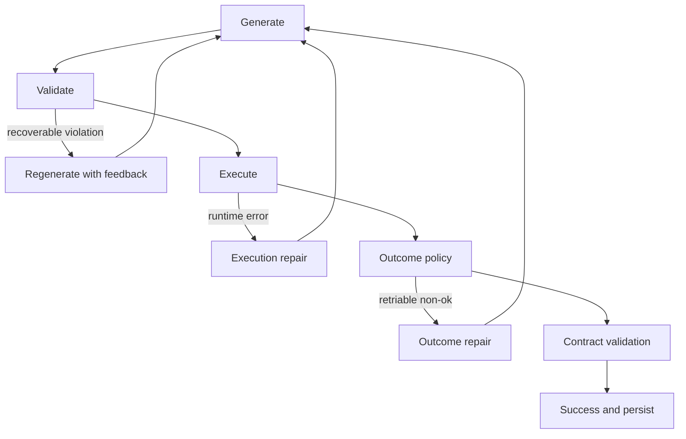

# Recurgent Architecture Onboarding

Audience: experienced software engineers who want a precise mental model of how Recurgent works today and how to contribute without violating project philosophy.

## Read This Like a System Story

This is a guided walk from first principle to current runtime behavior.

1. Start with mission and one concrete example.
2. Learn the smallest core mechanism (`method_missing` + generated code).
3. Add one architectural layer at a time.
4. Tie each layer to why it exists (ADR intent) and how it is implemented (runtime components).
5. End with contribution patterns that match Recurgent tenets.

If you only have 20 minutes: read Chapters 0, 1, 5, 8, 10, 11.

---

## Chapter 0: Mission in One Snippet

Recurgent is an agent runtime where capability is discovered and hardened through use, not fully predeclared.

```ruby
assistant = Agent.for("personal assistant that remembers conversation history")

assistant.ask("What's the top news from Google News, Yahoo, and NYT?")
assistant.ask("What are action-adventure movies in theaters?")
assistant.ask("What's a good recipe for Jaffna Kool?")
```

What matters is not "did it answer once?" but:

1. Did it delegate correctly?
2. Did it return typed outcomes?
3. Did it preserve evidence/provenance when required?
4. Did stable behavior get promoted and brittle behavior get repaired?

That is the runtime's core mission: reliable emergence.

---

## Chapter 1: The Irreducible Core (Dynamic Dispatch)

### Goal

Make unknown domain methods callable without pre-registering every method.

### Problem

Conventional frameworks require predefined tool schemas and static interfaces.

### Solution

ADR 0001 establishes `method_missing` as the dynamic boundary.

Before (static interface world):

```ruby
class Calculator
  def add(x, y)
    x + y
  end
end
```

After (Recurgent runtime surface):

```ruby
calc = Agent.for("calculator")
calc.add(3)
calc.sqrt(144)
calc.solve("2x + 5 = 17")
```

The runtime intercepts unknown calls, prompts a model, validates generated code, executes it, then returns `Agent::Outcome`.

### Core invariant

Keep `Agent` host methods narrow so domain namespace stays dynamic.

Reserved host/runtime methods include `tool`, `delegate`, `remember`, `runtime_context`, `to_s`, `inspect`.

---

## Chapter 2: Multi-Provider + Typed Outcomes

### Goal

Keep dispatch logic provider-agnostic and failure semantics predictable.

### Problem

Without a provider abstraction and typed errors, runtime behavior becomes vendor-coupled and brittle.

### Solution

1. ADR 0002: provider abstraction + model routing.
2. ADR 0003: typed `Outcome` envelope (`ok`/`error`, `error_type`, `error_message`, retriable flag).

Before (opaque failures):

```ruby
result = agent.ask("...")
# could be raw string or exception
```

After (typed boundary):

```ruby
outcome = agent.ask("...")
if outcome.ok?
  puts outcome.value
else
  warn "#{outcome.error_type}: #{outcome.error_message}"
end
```

### Why this matters

Every higher-level layer (guardrails, contracts, retries, promotion) assumes this typed boundary.

---

## Chapter 3: Ubiquitous Language (Tool Builder/Tool)

### Goal

Align runtime semantics with how agents actually solve problems.

### Problem

"Orchestrator/worker" language underspecifies intent and encourages process-centric designs.

### Solution

ADR 0008 defines canonical UL:

1. `Tool Builder`: top-level problem owner.
2. `Tool`: delegated sub-capability agent.
3. `Delegate`: one Tool Builder -> Tool action.
4. `Outcome`: normalized result envelope.
5. `Synthesis`: Tool Builder reconciliation step.

This language appears across prompts, logs, docs, and plans.

---

## Chapter 4: Repository and Contract Topology

### Goal

Support multiple runtimes without semantic drift.

### Problem

As Ruby and Lua evolve, implementation details can diverge from behavior contract.

### Solution

1. ADR 0006: monorepo runtime boundaries ([`runtimes/ruby`](../runtimes/ruby), [`runtimes/lua`](../runtimes/lua)).
2. ADR 0007: runtime-agnostic contract package under [`specs/contract/v1`](../specs/contract/v1).

Important split:

1. [`specs/contract/`](../specs/contract): normative behavior contract and scenarios.
2. [`docs/product-specs/`](product-specs): product/design specifications.

This separation is critical: implementation parity belongs to [`specs/`](../specs); product intent belongs to [`docs/`](.).

---

## Chapter 5: Generated Program + Dependency Environments

### Goal

Allow generated tools to use dependencies safely and deterministically.

### Problem

Stdlib-only generation is too limiting; in-process gem mutation is unsafe and non-deterministic.

### Solution

1. ADR 0010: generated program contract includes `code` + `dependencies`.
2. ADR 0011: deterministic `env_id` and effective-manifest execution rules.
3. Implementation plan: worker isolation + JSON boundary.

Before:

```ruby
# generated code assumed stdlib only
```

After:

```json
{
  "code": "...",
  "dependencies": [
    { "name": "nokogiri", "version": "~> 1.18" }
  ]
}
```

Execution path:

1. no deps -> sandbox execution.
2. deps -> worker execution in environment keyed by manifest/policy.

---

## Chapter 6: Persistence and Evolution Memory

### Goal

Make capabilities survive sessions and evolve based on evidence.

### Problem

Without persistence, each restart relearns the same tools.

### Solution

1. ADR 0012: cross-session tool registry + artifact store.
2. ADR 0013: cacheability gating + pattern memory.

Key idea:

1. Persistence identity remains stable (`role + method`).
2. Reuse is separately gated by cacheability/policy.

This prevents semantic cache poisoning (e.g., reusing query-specific logic for unrelated tasks).

---

## Chapter 7: Contract Boundary Hardening

### Goal

Guarantee that delegation boundaries are structurally honest and evolution-friendly.

### Problem

"Looks successful" can still be invalid at integration boundaries.

### Solution ladder:

1. ADR 0014: delegated outcome contract validation + tolerant canonicalization.
2. ADR 0015: boundary referrals (`wrong_tool_boundary`, `low_utility`) + evolution signals.
3. ADR 0017: runtime remains observational for utility semantics (no heuristic success->error rewriting).
4. ADR 0021: external-data successes must include provenance.
5. ADR 0022: normalize exhausted guardrail message at user boundary while preserving internal diagnostics.

Before (shape drift leaks):

```ruby
# caller assumes a shape that may drift silently
headlines = tool.get_headlines.value[:items]
```

After (contract boundary):

```ruby
outcome = tool.get_headlines(...)
# contract validator may map mismatch to contract_violation
```

---

## Chapter 8: Fresh Generation Lifecycle (Validation First)

### Goal

Make regeneration safe: no leaked partial state, bounded retries, diagnosable failures.

### Problem

Pre-ADR behavior could fail fast on recoverable guardrails and leak failed-attempt mutations.

### Solution

ADR 0016 + follow-on telemetry plan:

1. Generate -> validate -> execute lifecycle.
2. Attempt isolation with commit-on-success.
3. Bounded guardrail/execution/outcome repair lanes.
4. Persist failed-attempt diagnostics even when later retries succeed.

Sequence (simplified):



---

## Chapter 9: Context and Conversation Memory

### Goal

Improve long-context behavior without premature recursion primitives.

### Problem

Need stronger context access, but recursive APIs were premature.

### Solution

1. ADR 0018 proposed recursive primitives (`ContextView`, `recurse`).
2. ADR 0019 deliberately deferred recursion and shipped structured conversation history first.

Pragmatic consequence: history is first-class runtime data (`context[:conversation_history]`) and observable in traces.

---

## Chapter 10: Solver Shape and Reliability-Gated Promotion

### Goal

Turn "tool seems good" into explicit, auditable lifecycle policy.

### Problem

Reliability evidence existed but was diffuse and not connected to one canonical promotion contract.

### Solution (ADR 0023)

1. Capture `solver_shape` as first-class telemetry (`stance`, `capability_summary`, `reuse_basis`, `contract_intent`, `promotion_intent`).
2. Maintain version-scoped scorecards.
3. Lifecycle states: `candidate -> probation -> durable -> degraded`.
4. Promote only when reliability gates pass.

Important principle:

Prompt policy remains open-ended; typed solver shape captures decisions as data.

```ruby
# conceptually
prompt_policy -> decides
solver_shape -> records
promotion_policy -> gates lifecycle
```

---

## Chapter 11: Role Coherence (State Continuity Guard)

### Goal

Prevent sibling-method drift for role-style agents.

### Problem

Reliability can be high even when methods disagree on shared state conventions (`:memory` vs `:value`).

### Solution (ADR 0024)

1. Opt-in `RoleProfile` contracts.
2. Default coordination constraints (agreement required, value not pre-pinned).
3. Optional prescriptive constraints for deterministic pinning.
4. Scope-first model (`all_methods` default) so newly forged methods inherit constraints.
5. Violations route through existing recoverable lanes as `role_profile_continuity_violation`.

Before:

```ruby
# add uses :value, memory setter uses :memory
# both can appear successful
```

After:

```ruby
CALCULATOR_ROLE_PROFILE = {
  role: "calculator",
  version: 1,
  constraints: {
    accumulator_slot: {
      kind: :shared_state_slot,
      mode: :coordination
      # scope defaults to :all_methods
    }
  }
}
```

### Why this is subtle

Profiles define semantic correctness; scorecards define reliability. You need both.

---

## Chapter 12: Awareness vs Authority (Governance Plane)

### Goal

Expose self-awareness without permitting hidden self-mutation.

### Problem

Without an explicit authority boundary, reflective behavior can drift into uncontrolled policy mutation.

### Solution (ADR 0025)

Design rule: separate awareness from authority.

1. Awareness levels: `L1` observational, `L2` contract-aware, `L3` evolution-aware.
2. `L4` autonomous policy mutation explicitly excluded.
3. Authority tuple: `observe`, `propose`, `enact` (default `enact: false`).
4. Proposal artifacts + maintainer-approved apply/rollback for governance changes.

```ruby
self_model = agent.self_model
# { awareness_level: :l2, authority: { observe: true, propose: true, enact: false }, ... }
```

---

## Chapter 13: Runtime as Colored Layers


Layer read order:

1. Core call machinery (`method_missing`, provider, execution).
2. Safety boundaries (guardrails, retries, contract validation, normalization).
3. Evolution loop (persistence, scorecards, promotion, role profiles, authority governance).

---

## Infrastructure Primitives Catalog (Purpose + Mechanism + Code)

The runtime has multiple infrastructure primitives. They are orthogonal by design: each has a narrow job and composes with others.

| Primitive | Purpose | How it works | Primary code |
| --- | --- | --- | --- |
| Dynamic Dispatch | Make unknown domain methods executable without predeclared interfaces. | `method_missing` routes unresolved calls into generate -> validate -> execute lifecycle. | [`runtimes/ruby/lib/recurgent.rb`](../runtimes/ruby/lib/recurgent.rb), [`runtimes/ruby/lib/recurgent/call_execution.rb`](../runtimes/ruby/lib/recurgent/call_execution.rb) |
| Outcome Boundary | Keep success/failure semantics typed and composable across delegation. | Every return is coerced into `Agent::Outcome`; callers consume `ok?/error?`, `value`, `error_type`, `retriable`. | [`runtimes/ruby/lib/recurgent/outcome.rb`](../runtimes/ruby/lib/recurgent/outcome.rb) |
| Contract Validation | Prevent silent shape drift at delegation boundaries. | Delegated outputs are checked against declared contracts with tolerant canonicalization before acceptance. | [`runtimes/ruby/lib/recurgent/outcome_contract_validator.rb`](../runtimes/ruby/lib/recurgent/outcome_contract_validator.rb) |
| Guardrails + Repair Lanes | Recover from common generation/runtime failures without leaking partial state. | Validation-first retries, bounded repair budgets, and retry feedback injection across code/outcome lanes. | [`runtimes/ruby/lib/recurgent/fresh_generation.rb`](../runtimes/ruby/lib/recurgent/fresh_generation.rb), [`runtimes/ruby/lib/recurgent/fresh_outcome_repair.rb`](../runtimes/ruby/lib/recurgent/fresh_outcome_repair.rb), [`runtimes/ruby/lib/recurgent/guardrail_code_checks.rb`](../runtimes/ruby/lib/recurgent/guardrail_code_checks.rb) |
| Attempt Isolation | Ensure failed attempts do not pollute committed runtime state. | Snapshot-and-rollback around attempts; commit only on successful terminal attempt. | [`runtimes/ruby/lib/recurgent/attempt_isolation.rb`](../runtimes/ruby/lib/recurgent/attempt_isolation.rb) |
| Execution Isolation | Prevent generated methods from leaking onto host agent surface. | Generated code executes inside disposable `ExecutionSandbox` receivers. | [`runtimes/ruby/lib/recurgent/execution_sandbox.rb`](../runtimes/ruby/lib/recurgent/execution_sandbox.rb), [`runtimes/ruby/lib/recurgent.rb`](../runtimes/ruby/lib/recurgent.rb) |
| Dependency Environment | Run dependency-bearing generated code deterministically and safely. | Dependency manifests map to environment IDs; worker execution for dependency paths. | [`runtimes/ruby/lib/recurgent/dependencies.rb`](../runtimes/ruby/lib/recurgent/dependencies.rb), [`runtimes/ruby/lib/recurgent/worker_execution.rb`](../runtimes/ruby/lib/recurgent/worker_execution.rb) |
| Continuity Infrastructure | Preserve coherence across turns/sessions in multiple dimensions. | Four layers: state (`context`), event (`conversation_history`), executable (artifacts/tools), response-content (`content_ref` + content store). | [`runtimes/ruby/lib/recurgent/conversation_history.rb`](../runtimes/ruby/lib/recurgent/conversation_history.rb), [`runtimes/ruby/lib/recurgent/content_store.rb`](../runtimes/ruby/lib/recurgent/content_store.rb), [`runtimes/ruby/lib/recurgent/artifact_store.rb`](../runtimes/ruby/lib/recurgent/artifact_store.rb), [`runtimes/ruby/lib/recurgent/tool_store.rb`](../runtimes/ruby/lib/recurgent/tool_store.rb) |
| Persistence Infrastructure | Retain tool/artifact identity and evidence across sessions. | Tool registry + versioned artifact store + metadata/scorecards persisted under toolstore root. | [`runtimes/ruby/lib/recurgent/tool_store.rb`](../runtimes/ruby/lib/recurgent/tool_store.rb), [`runtimes/ruby/lib/recurgent/artifact_store.rb`](../runtimes/ruby/lib/recurgent/artifact_store.rb) |
| Promotion Infrastructure | Convert observed reliability into explicit lifecycle transitions. | Scorecards + policy gating over `candidate -> probation -> durable -> degraded`. | [`runtimes/ruby/lib/recurgent/artifact_metrics.rb`](../runtimes/ruby/lib/recurgent/artifact_metrics.rb), [`runtimes/ruby/lib/recurgent/artifact_selector.rb`](../runtimes/ruby/lib/recurgent/artifact_selector.rb) |
| Role Coherence Infrastructure | Enforce sibling-method semantic coherence for role-like agents. | Opt-in role profiles with coordination/prescriptive constraints evaluated through recoverable guardrail lanes. | [`runtimes/ruby/lib/recurgent/role_profile_guard.rb`](../runtimes/ruby/lib/recurgent/role_profile_guard.rb), [`runtimes/ruby/lib/recurgent/role_profile_registry.rb`](../runtimes/ruby/lib/recurgent/role_profile_registry.rb) |
| Awareness Infrastructure | Expose runtime self-model as data for inspection and proposal quality. | Call state captures awareness level, authority tuple, active contract/profile versions, and snapshot refs. | [`runtimes/ruby/lib/recurgent/call_state.rb`](../runtimes/ruby/lib/recurgent/call_state.rb) |
| Authority + Governance Infrastructure | Separate propose from enact; keep mutations auditable and approved. | Proposal artifacts, approval/apply workflow, maintainer-gated mutation paths. | [`runtimes/ruby/lib/recurgent/proposal_store.rb`](../runtimes/ruby/lib/recurgent/proposal_store.rb), [`runtimes/ruby/lib/recurgent/authority.rb`](../runtimes/ruby/lib/recurgent/authority.rb), [`runtimes/ruby/lib/recurgent.rb`](../runtimes/ruby/lib/recurgent.rb) |
| Observability Infrastructure | Make runtime behavior mechanically inspectable and testable from traces. | JSONL logs capture prompts, outcomes, attempts, contracts, continuity, and lifecycle fields. | [`runtimes/ruby/lib/recurgent/observability.rb`](../runtimes/ruby/lib/recurgent/observability.rb), [`docs/observability.md`](observability.md) |

Reading rule of thumb:

1. If you are changing execution mechanics, touch dispatch + guardrail + observability together.
2. If you are changing semantic correctness, touch role profiles/contracts before promotion policy.
3. If you are changing policy, route mutation through authority-governed proposal paths.

---

## Chapter 14: ADR and Plan Ladder (Why the System Looks Like This)

The architecture is cumulative, not monolithic.

1. `0001-0003`: dispatch, provider abstraction, typed outcomes.
2. `0004-0009`: coordination language, naming, monorepo boundaries, contract packaging, contribution governance.
3. `0010-0013`: dependency/runtime environment + persistence + cacheability/pattern memory.
4. `0014-0017`: boundary validation + utility/semantics pressure model + validation-first recovery.
5. `0018-0022`: context-history prioritization, sandbox isolation, provenance invariant, boundary normalization.
6. `0023-0025`: solver-shape evidence, reliability-gated promotion, role continuity contracts, awareness/authority substrate.

Implementation plans operationalize each ADR with phased deltas, validation signals, and rollback triggers.

---

## Chapter 15: Contribution Playbook (What "Good" Looks Like)

When you contribute, match the project's development philosophy:

1. Agent-first mental model.
2. Tolerant interfaces by default.
3. Introspection/prescription/evolution ergonomics over process ceremony.
4. Separate awareness from authority.

### Contribution flow

1. Identify architectural layer touched (dispatch, boundary, persistence, evolution, governance).
2. Update ADR/plan if behavior contract changes.
3. Implement with typed outcomes and explicit observability fields.
4. Validate with tests plus trace-level evidence.
5. Keep change sets atomic and narratively coherent.

### Runtime change checklist

1. Does this shrink dynamic namespace unnecessarily?
2. Does this preserve typed `Outcome` semantics?
3. Does this keep non-profile flows stable unless explicitly changed?
4. Are retries/guardrails bounded and diagnosable?
5. Is user boundary normalized while internal diagnostics remain rich?
6. If mutation/governance is involved, is authority gating explicit?

---

## Meme Break (Text-Only)

```
Engineer: "Can we just hardcode this one method?"
Recurgent: "Or we can define the boundary, emit evidence, and evolve the capability class."
```

---

## Quick Knowledge Checks

### Quiz 1

Which pair is correct?

1. scorecard defines semantics, role profile defines reliability
2. scorecard defines reliability, role profile defines semantics
3. both are interchangeable

### Quiz 2

Why is `role_profile_continuity_violation` routed through recoverable lanes instead of a brand new subsystem?

1. to reuse existing retry/repair policy and telemetry semantics
2. because profile checks are optional and should never be visible
3. because guardrails cannot carry typed violations

### Quiz 3

What does "separate awareness from authority" enforce?

1. agent cannot observe runtime state
2. agent can propose, but enact requires explicit approval
3. agent can always self-mutate if it passes scorecard gates

Answers:

1. Quiz 1 -> 2
2. Quiz 2 -> 1
3. Quiz 3 -> 2

---

## Fast Code Reading Path (If You Want to Contribute Today)

1. [`runtimes/ruby/lib/recurgent.rb`](../runtimes/ruby/lib/recurgent.rb) (dynamic surface and primitives)
2. [`runtimes/ruby/lib/recurgent/call_execution.rb`](../runtimes/ruby/lib/recurgent/call_execution.rb) + `fresh_generation.rb`
3. [`runtimes/ruby/lib/recurgent/outcome.rb`](../runtimes/ruby/lib/recurgent/outcome.rb) + `outcome_contract_validator.rb`
4. [`runtimes/ruby/lib/recurgent/artifact_store.rb`](../runtimes/ruby/lib/recurgent/artifact_store.rb) + `artifact_selector.rb` + `tool_store.rb`
5. [`runtimes/ruby/lib/recurgent/role_profile.rb`](../runtimes/ruby/lib/recurgent/role_profile.rb) + `role_profile_guard.rb` + `role_profile_registry.rb`
6. [`runtimes/ruby/lib/recurgent/authority.rb`](../runtimes/ruby/lib/recurgent/authority.rb) + `proposal_store.rb` + `call_state.rb`
7. [`runtimes/ruby/lib/recurgent/observability.rb`](../runtimes/ruby/lib/recurgent/observability.rb) + `observability_attempt_fields.rb`

Then cross-check with:

1. [`docs/architecture.md`](architecture.md)
2. [`docs/ubiquitous-language.md`](ubiquitous-language.md)
3. [`docs/adrs/0023-solver-shape-and-reliability-gated-tool-evolution.md`](adrs/0023-solver-shape-and-reliability-gated-tool-evolution.md)
4. [`docs/adrs/0024-contract-first-role-profiles-and-state-continuity-guard.md`](adrs/0024-contract-first-role-profiles-and-state-continuity-guard.md)
5. [`docs/adrs/0025-awareness-substrate-and-authority-boundary.md`](adrs/0025-awareness-substrate-and-authority-boundary.md)
6. [`docs/plans/contract-first-role-profiles-state-continuity-implementation-plan.md`](plans/contract-first-role-profiles-state-continuity-implementation-plan.md)
7. [`docs/plans/awareness-substrate-authority-boundary-implementation-plan.md`](plans/awareness-substrate-authority-boundary-implementation-plan.md)

---

## Appendix A: ADR Catalog at a Glance

Use this as the architecture timeline index.

| ADR | Core decision |
| --- | --- |
| 0001 | Dynamic dispatch via `method_missing` is the runtime core. |
| 0002 | Provider abstraction and model routing are decoupled from runtime logic. |
| 0003 | Failures are typed through `Outcome` instead of opaque exceptions/strings. |
| 0004 | Coordination API and language become LLM-native (`for`, `delegate`, `remember`). |
| 0005 | Naming hard cut to Recurgent. |
| 0006 | Monorepo runtime partitioning ([`runtimes/ruby`](../runtimes/ruby), [`runtimes/lua`](../runtimes/lua)). |
| 0007 | Runtime-agnostic normative contract package under [`specs/contract/v1`](../specs/contract/v1). |
| 0008 | Tool Builder/Tool UL and tolerant delegation interface become canonical. |
| 0009 | Issue-first PR compliance is enforced as repository governance. |
| 0010 | Generated programs can declare dependencies; environment contract introduced. |
| 0011 | Deterministic environment identity and effective-manifest execution policy. |
| 0012 | Cross-session tool/artifact persistence and evolutionary selection policy. |
| 0013 | Cacheability gating and pattern memory for safe reuse/promotion pressure. |
| 0014 | Delegated outcome contract validation and tolerant boundary canonicalization. |
| 0015 | Boundary referral signals (`wrong_tool_boundary`, `low_utility`) + evolution lanes. |
| 0016 | Validation-first fresh generation with transactional retries and rollback. |
| 0017 | Runtime remains observational for utility semantics; no heuristic coercion. |
| 0018 | Recursive context primitives proposed (`ContextView`, `recurse`). |
| 0019 | Structured conversation history shipped first; recursion deferred. |
| 0020 | Per-attempt execution sandbox isolates generated code from host method surface. |
| 0021 | External-data success requires provenance evidence. |
| 0022 | Guardrail retry exhaustion is normalized at user boundary. |
| 0023 | Solver shape and reliability-gated promotion lifecycle become explicit. |
| 0024 | Opt-in role profiles and state continuity guard for role coherence. |
| 0025 | Awareness substrate + authority boundary (observe/propose/enact separation). |

Note: ADR status markers may lag implementation. For \"what is live,\" use runtime code + validation reports as source of truth.

---

## Appendix B: Implementation Plan Catalog by Concern

### Core Runtime Evolution

1. [`docs/plans/recurgent-implementation-plan.md`](plans/recurgent-implementation-plan.md)
2. [`docs/plans/dependency-environment-implementation-plan.md`](plans/dependency-environment-implementation-plan.md)
3. [`docs/plans/cross-session-tool-persistence-implementation-plan.md`](plans/cross-session-tool-persistence-implementation-plan.md)
4. [`docs/plans/cacheability-pattern-memory-implementation-plan.md`](plans/cacheability-pattern-memory-implementation-plan.md)
5. [`docs/plans/solver-shape-reliability-gated-tool-evolution-implementation-plan.md`](plans/solver-shape-reliability-gated-tool-evolution-implementation-plan.md)

### Contract and Boundary Hardening

1. [`docs/plans/outcome-boundary-contract-validation-implementation-plan.md`](plans/outcome-boundary-contract-validation-implementation-plan.md)
2. [`docs/plans/tool-self-awareness-boundary-referral-implementation-plan.md`](plans/tool-self-awareness-boundary-referral-implementation-plan.md)
3. [`docs/plans/validation-first-fresh-generation-implementation-plan.md`](plans/validation-first-fresh-generation-implementation-plan.md)
4. [`docs/plans/contract-driven-utility-failures-implementation-plan.md`](plans/contract-driven-utility-failures-implementation-plan.md)
5. [`docs/plans/guardrail-exhaustion-boundary-normalization-implementation-plan.md`](plans/guardrail-exhaustion-boundary-normalization-implementation-plan.md)
6. [`docs/plans/contract-first-role-profiles-state-continuity-implementation-plan.md`](plans/contract-first-role-profiles-state-continuity-implementation-plan.md)

### Context, Execution, and Telemetry

1. [`docs/plans/structured-conversation-history-implementation-plan.md`](plans/structured-conversation-history-implementation-plan.md)
2. [`docs/plans/generated-code-execution-sandbox-isolation-implementation-plan.md`](plans/generated-code-execution-sandbox-isolation-implementation-plan.md)
3. [`docs/plans/external-data-provenance-implementation-plan.md`](plans/external-data-provenance-implementation-plan.md)
4. [`docs/plans/failed-attempt-exception-telemetry-implementation-plan.md`](plans/failed-attempt-exception-telemetry-implementation-plan.md)
5. [`docs/plans/awareness-substrate-authority-boundary-implementation-plan.md`](plans/awareness-substrate-authority-boundary-implementation-plan.md)

Planning discipline across this repo is not generic PM ceremony: each plan is expected to define measurable deltas, non-improvement expectations, phase-level improvement contracts, and rollback triggers.

---

## Final Mental Model

Recurgent is not "LLM writes code". It is a layered runtime where:

1. dynamic dispatch enables emergence,
2. typed boundaries keep behavior honest,
3. persistence and scorecards make behavior durable,
4. contracts enforce role coherence where reliability alone is insufficient,
5. governance keeps reflective evolution auditable and controlled.

If your change strengthens one layer without violating the others, it is probably aligned with project philosophy.
