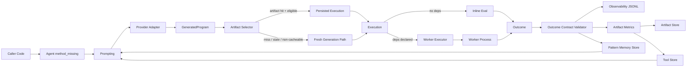
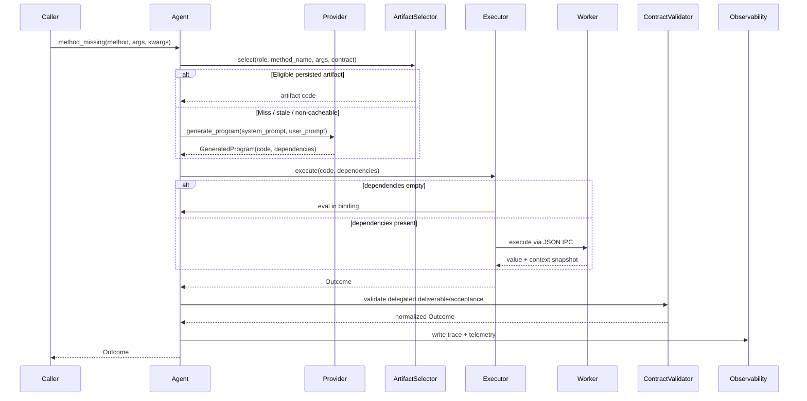
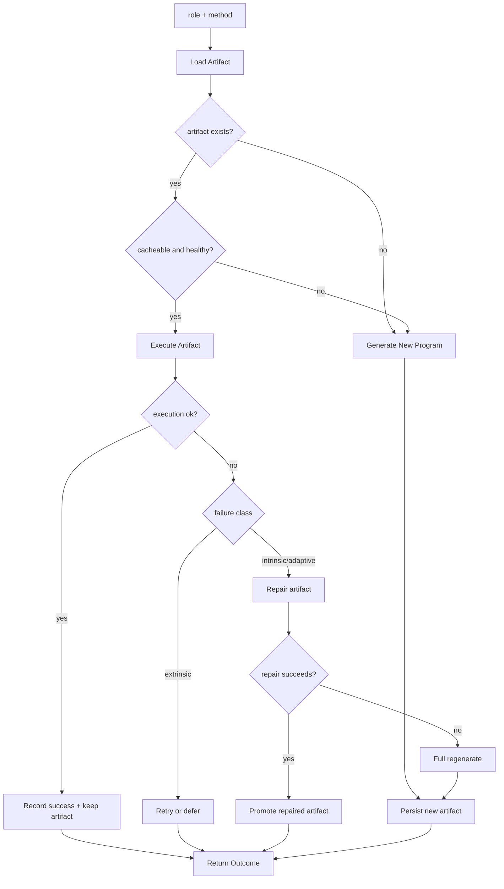
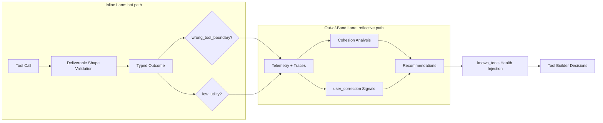

# Runtime Architecture

This document is the canonical architecture map for the current Ruby runtime (`runtimes/ruby`).

It reflects the implemented model across:

1. Tool Builder / Tool / Worker execution roles.
2. Cross-session persistence and cacheability-gated artifact reuse.
3. Contract validation, tolerant outcomes, pattern memory, and dual-lane evolution.

## Component Map

## Top-Level Call Flow

## Artifact Reuse and Repair Policy

## Dual-Lane Evolution Model

## Key Runtime Boundaries

1. `runtimes/ruby/lib/recurgent.rb` is the entry boundary for dynamic dispatch and runtime orchestration.
2. `runtimes/ruby/lib/recurgent/persisted_execution.rb` and `runtimes/ruby/lib/recurgent/artifact_selector.rb` own persisted-vs-fresh execution decisions.
3. `runtimes/ruby/lib/recurgent/outcome_contract_validator.rb` is the delegated contract boundary (`deliverable`, `acceptance`).
4. `runtimes/ruby/lib/recurgent/tool_store.rb` and `runtimes/ruby/lib/recurgent/artifact_store.rb` own cross-session state.
5. `runtimes/ruby/lib/recurgent/pattern_memory_store.rb` and `runtimes/ruby/lib/recurgent/user_correction_signals.rb` feed promotion/evolution signals.
6. `runtimes/ruby/lib/recurgent/tool_maintenance.rb` owns out-of-band maintenance and recommendation workflows.
