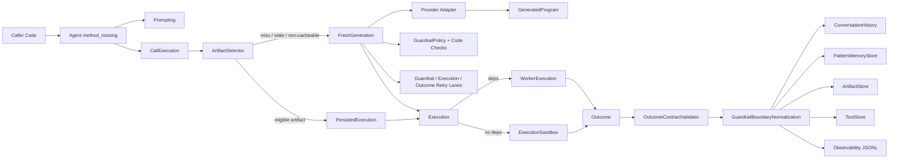
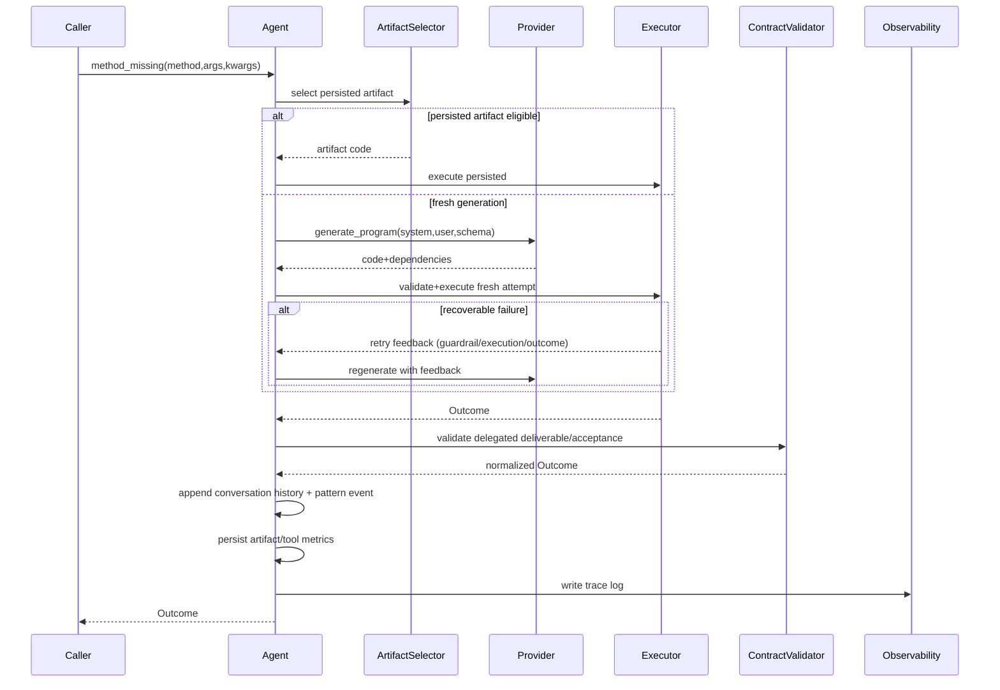
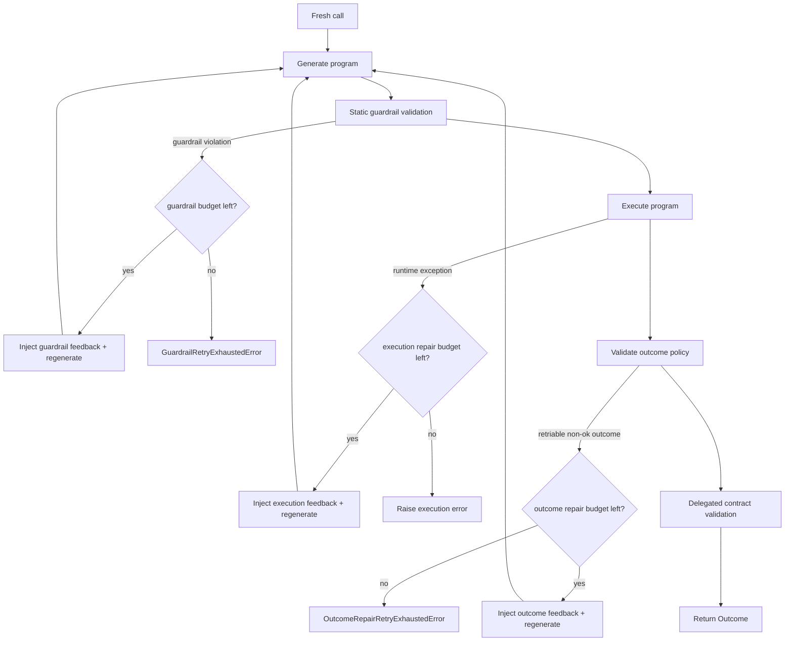

# Runtime Architecture

This document is the canonical architecture map for the current Ruby runtime ([`runtimes/ruby`](../runtimes/ruby)).

It reflects the implemented system after the recent lifecycle and boundary hardening work:

1. Tool Builder / Tool / Worker execution gradient.
2. Fresh-generation lifecycle with validation-first retries and transactional rollback.
3. Cross-session tool/artifact persistence with cacheability gating.
4. Delegated outcome contract validation and tolerant interface handling.
5. Structured conversation history, pattern memory, and user-correction signals.
6. Guardrail exhaustion boundary normalization and failed-attempt telemetry capture.

## Architectural Intent

Recurgent is designed for reliable emergence:

- Generate behavior at call time.
- Preserve useful behavior across sessions.
- Detect and repair brittle behavior.
- Keep user-facing boundaries honest and typed.

## System Model

### Role Gradient

1. Tool Builder (depth 0): decides when to Do, Shape, Forge, Orchestrate.
2. Tool (depth 1): executes delegated contract work with bounded scope.
3. Worker (depth >= 2): direct execution, minimal decomposition overhead.

### Runtime Principles

1. Agent-first runtime surface (`method_missing` dispatch).
2. Tolerant interfaces at boundaries (symbol/string key tolerance, typed outcomes).
3. Validation before execution retries.
4. Observability as a first-class runtime product.

### Dynamic Dispatch Boundary (Ruby)

`method_missing` is the dynamic call boundary. Calls bypass dynamic generation when method names are explicitly defined on `Agent`.

Current explicit `Agent` method surface:

- `tool`
- `delegate`
- `remember`
- `runtime_context`
- `to_s`
- `inspect`
- `define_singleton_method` (guardrail)

Execution-wrapper locals for generated code:

- `context` is the canonical mutable state surface.
- `memory` is a local alias to `context` in execution wrappers (sandbox + worker) to absorb model priors without adding host method collisions.

Design invariant:

- Keep public `Agent` method surface narrow; preserve dynamic namespace for emergent domain methods.

## Component Map

## Dynamic Call Lifecycle

## Fresh Generation Lifecycle (Validation-First)

## Persistence and Selection

### Tool Registry (`ToolStore`)

- Persists delegated tool metadata (`purpose`, `methods`, `deliverable`, `acceptance`, counters).
- Hydrates `context[:tools]` on startup.
- Tracks usage/success/failure counts.

### Method Artifact Store (`ArtifactStore`)

- Persists generated code per `role + method`.
- Stores:
  - checksum, prompt/runtime versions, dependencies,
  - cacheability metadata,
  - success/failure metrics and rates,
  - generation history (bounded),
  - trigger diagnostics (stage/class/message/attempt_id) for failed-attempt provenance.

### Selection (`ArtifactSelector`)

Artifact executes only when:

1. Cacheability policy allows reuse.
2. Runtime version compatibility holds.
3. Contract fingerprint matches.
4. Code checksum is valid.
5. Artifact is not degraded by health policy.

Otherwise runtime falls back to fresh generation.

## Boundary Semantics

### Delegated Outcome Contract Boundary

`OutcomeContractValidator` enforces delegated `deliverable` shape on successful delegated outcomes.

- Tolerant key semantics (symbol/string).
- Shape mismatch converts to typed `contract_violation` outcome.
- Validation state is captured in call telemetry fields.

### Guardrail Exhaustion User Boundary

`GuardrailBoundaryNormalization` normalizes top-level exhausted guardrail failures:

- Internal subtype/metadata is preserved.
- User-facing message is stabilized:
  - `"This request couldn't be completed after multiple attempts."`

### Source/Provenance Boundary

`ConversationHistory` stores compact source refs in `outcome_summary` when provenance is present:

- `source_count`
- `primary_uri`
- `retrieval_mode`

This supports source follow-up behavior without preloading full prior records into prompts.

## Conversation and Pattern Memory

### Structured Conversation History

Each call appends one canonical record with:

- call identity (`trace_id`, `call_id`, `parent_call_id`, `depth`)
- method invocation (`method_name`, `args`, `kwargs`)
- compact `outcome_summary`
- timing (`duration_ms`, timestamp)

### Pattern Memory

`PatternMemoryStore` records capability-pattern events for generated/repaired calls and tracks user-correction signals.

Used to inject recent pattern summaries back into prompting at depth 0.

## Observability Model

JSONL log entries include:

1. Invocation identity and timing.
2. Program source (`generated`, `persisted`, `repaired`) and dependencies.
3. Contract validation fields.
4. Retry-lane counters:
  - `guardrail_recovery_attempts`
  - `execution_repair_attempts`
  - `outcome_repair_attempts`
5. Attempt failure telemetry:
  - `attempt_failures[]`
  - `latest_failure_stage/class/message`
6. Cacheability and artifact-hit metadata.
7. Optional debug envelope (prompts/context/error backtrace) when debug is enabled.

## Runtime Data Surfaces

Primary persisted files under toolstore root:

- `registry.json` - tool registry metadata
- `patterns.json` - pattern-memory events
- `artifacts/<role>/<method>.json` - per-method code artifact

Path defaults are XDG-compliant through runtime config.

## Current Boundaries of This Document

This document describes implemented runtime behavior.

For rationale and tradeoffs:

- see [`docs/adrs/`](adrs).

For phased execution detail:

- see [`docs/plans/`](plans).
