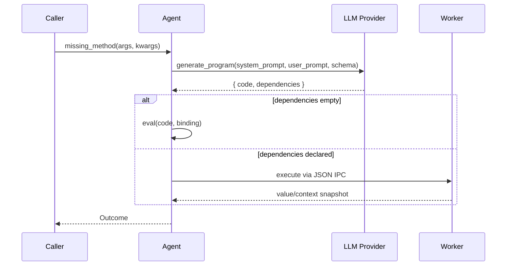

# Documentation Index

## Core Documents

- `docs/onboarding.md` - setup, workflow, quality gates
- `docs/idea-brief.md` - product vision and design intent
- `docs/ubiquitous-language.md` - canonical Tool Builder/Tool vocabulary
- `docs/tolerant-delegation-interfaces.md` - tolerant delegation design guidance and examples
- `docs/delegate-vs-for.md` - concrete `delegate(...)` vs `Agent.for(...)` decision guide
- `docs/delegation-contracts.md` - Phase 1 Tool Builder-authored Tool contract metadata for both `Agent.for(...)` and `delegate(...)`
- `docs/observability.md` - mechanistic interpretability via shared log schema and live watcher
- `docs/recurgent-implementation-plan.md` - phased plan for LLM-native coordination API and naming transition
- `docs/dependency-environment-implementation-plan.md` - detailed phased implementation plan for ADR 0010 dependency-aware environments
- `docs/roadmap.md` - near/mid/long-term roadmap
- `docs/governance.md` - maintainer governance and decision model
- `docs/support.md` - support policy and triage expectations
- `docs/release-process.md` - release process and SemVer policy
- `docs/open-source-release-checklist.md` - OSS launch readiness and manual GitHub settings checklist
- `docs/adrs/README.md` - architecture decision index and status model
- `docs/maintenance.md` - runtime and dependency maintenance policy
- `CONTRIBUTING.md` - contribution policy and quality gates
- `CODE_OF_CONDUCT.md` - collaboration and anti-spam behavior policy
- `SECURITY.md` - vulnerability reporting policy
- `CHANGELOG.md` - release notes history
- `specs/contract/README.md` - runtime-agnostic contract package
- `specs/contract/v1/agent-contract.md` - normative Agent behavior contract (v1)
- `specs/contract/v1/scenarios.yaml` - shared conformance scenarios (v1)
- `specs/contract/v1/tolerant-delegation-profile.md` - tolerant delegation profile
- `specs/contract/v1/tolerant-delegation-scenarios.yaml` - tolerant delegation scenarios (v1)
- `runtimes/ruby/README.md` - Ruby runtime quick reference
- `runtimes/lua/README.md` - Lua runtime placeholder

## Architecture Overview

The Ruby runtime (`runtimes/ruby`) keeps a narrow architecture:

- `runtimes/ruby/lib/recurgent.rb` - dynamic dispatch, execution, retry, and outcome mapping
- `runtimes/ruby/lib/recurgent/prompting.rb` - system/user prompt construction and tool schema
- `runtimes/ruby/lib/recurgent/observability.rb` - JSONL log entry construction and debug metadata
- `runtimes/ruby/lib/recurgent/call_execution.rb` - dynamic call orchestration and execution path selection
- `runtimes/ruby/lib/recurgent/outcome.rb` - `Agent::Outcome` envelope model
- `runtimes/ruby/lib/recurgent/providers.rb` - provider adapters (Anthropic/OpenAI)
- `runtimes/ruby/lib/recurgent/dependency_manifest.rb` - dependency declaration normalization
- `runtimes/ruby/lib/recurgent/environment_manager.rb` - environment materialization and cache
- `runtimes/ruby/lib/recurgent/worker_executor.rb` - worker process IPC execution
- `runtimes/ruby/lib/recurgent/worker_supervisor.rb` - worker lifecycle and restart handling
- `runtimes/ruby/lib/recurgent/preparation_ticket.rb` - async environment preparation lifecycle
- `runtimes/ruby/spec/recurgent_spec.rb` - unit/contract tests
- `runtimes/ruby/examples/` - executable behavior demonstrations

## Data Flow

## Documentation Rules

- Put all long-form project docs under `docs/`.
- Record architecture decisions in `docs/adrs/`.
- Keep this index updated when adding docs.
