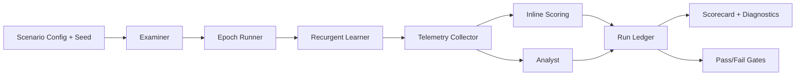

# Recursim Product Specification

## Document Status

- Name: Recursim
- Type: Product Specification
- Status: Draft v3
- Scope: Recurgent simulator for self-contained system growth

## 1. Purpose

Recursim exists to provide evidence, not anecdotes, that Recurgent can:

1. Survive real evolutionary pressure without harness breakage.
2. Produce reliable emergence where local generation is stochastic but global outcomes are predictable.

Recursim is the controlled laboratory where Tool Builders, Tools, and Workers can evolve under repeatable conditions with measurable outcomes.

## 2. Problem Statement

Recurgent currently demonstrates promising behavior in live examples, but example-driven confidence is insufficient.

Missing today:

1. A simulation harness that repeatedly exercises full lifecycle behavior.
2. A formal definition of reliable emergence and how to measure it.
3. A progression model from simple closed domains to open and networked systems.

Without Recursim, regressions hide in ad hoc runs, and evolution claims are not falsifiable.

## 3. Product Goals

### 3.1 Primary Goals

1. Validate harness robustness under long-running, adversarial, and edge-case evolutionary loops.
2. Validate reliable emergence for self-contained systems as the first milestone.
3. Produce reproducible simulation traces and scorecards that can be compared across commits.

### 3.2 Secondary Goals

1. Accelerate discovery of architecture faults before they appear in interactive demos.
2. Provide a canonical benchmark suite for Recurgent evolution quality.
3. Create reusable scenario infrastructure for future simulation classes.

## 4. Non-Goals (V1)

1. Replacing runtime integration tests.
2. Proving performance for distributed/networked Recurgent systems.
3. Implementing autonomous internet-scale multi-agent networking.
4. Hardcoding domain tools in runtime internals.

## 5. Simulation Taxonomy

Recursim supports four system classes over time.

1. Self-contained systems.
Examples: calculator, debate panel.
2. Inter-connected systems.
Examples: daily news purveyor integrating multiple sources.
3. Interactive systems.
Examples: personal assistant with human-in-the-loop corrections.
4. Networked Recurgents.
Examples: federated Recurgents exchanging reusable tools.

V1 targets class 1 only.

## 6. Core Roles and Vocabulary

Recursim uses three first-class roles.

1. Learner.
The Recurgent under growth. Formerly called Subject.
2. Examiner.
Generates curriculum and adversarial probes for each epoch. Formerly called Challenge/Challenger.
3. Analyst.
Evaluates traces and scores, then emits next-epoch recommendations.

Role mapping to Recurgent UL:

1. Learner runs Tool Builder/Tool/Worker behavior inside the harness.
2. Examiner defines pressure, not implementation.
3. Analyst observes and recommends; it does not directly mutate runtime internals.

## 7. V1 Scope: Self-Contained Growth

### 7.1 V1 Target Domain

Calculator growth curriculum.

1. Core arithmetic: add, subtract, multiply, divide.
2. Input handling: integers, floats, negative values, whitespace tolerance.
3. Error discipline: typed failures (for example divide by zero, invalid expression).
4. Composition: expression evaluation with precedence and parentheses.
5. Scientific extension: constants and unary functions.

### 7.2 Why Calculator First

1. Closed-world correctness oracle is simple and objective.
2. High signal-to-noise ratio for harness defects.
3. Enables many edge cases without external dependencies.
4. Fast simulation cycles enable broad seed sweeps.

## 8. Design Principles

Recursim adheres to Recurgent tenets.

1. Agent-first mental model.
All simulator entities are modeled in Tool Builder/Tool/Worker language.
2. Tolerant interfaces by default.
Scoring and validation use tolerant boundary checks before terminal classification.
3. Runtime ergonomics and clarity before constraints.
Recursim observes and pressures behavior; it does not hardcode domain logic.
4. Ubiquitous language aligned to Agent cognition.
Reports and telemetry use the same vocabulary as runtime prompts and ADRs.

## 9. Reliable Emergence Definition

Reliable emergence means:

1. Local behavior can vary by seed.
2. Global outcomes converge within pre-defined tolerance bands.

### 9.1 Default Convergence Bands (V1)

Defaults are explicit for implementation and CI gating.

1. Local seed count `N_local = 8`.
2. CI seed count `N_ci = 24`.
3. Epoch threshold `E = 20`.
4. Correctness median >= `0.95` by epoch `E`.
5. Repair depth p90 <= `3` by epoch `E`.
6. Contract violation rate in epochs 16..20 is at least 40% lower than epochs 1..5.
7. Reuse ratio in epochs 16..20 is at least 0.25 higher than epochs 1..5.
8. Terminal architecture integrity violations = `0`.

## 10. Product Requirements

### 10.1 Scenario Definition

Recursim must support scenario packs with:

1. System class.
2. Curriculum stages.
3. Golden input/output cases.
4. Adversarial cases.
5. Evolution pressure profile.
6. Termination criteria.

### 10.2 Examiner Behavior

V1 Examiner behavior is deterministic and curriculum-driven.

1. Invocations are selected from scripted scenario packs.
2. Selection is seeded and replayable.
3. Adaptive invocation generation is deferred to V2.
4. V2 may allow Examiner to be a Recurgent role.

### 10.2.1 V1 Evolution Pressure Profile (Calculator)

V1 uses epoch-gated curriculum pressure to remove ambiguity about stage exposure.

1. Epochs 1..4: stages A1..A2 only.
2. Epochs 5..10: stages A1..A4.
3. Epochs 11..14: stages A1..A5.
4. Epochs 15..20: stages A1..A8.
5. Canary cases run in every epoch and are stage-independent.

### 10.3 Epoch Runner

Recursim must execute simulations as epochs.

Each epoch includes:

1. Invocation generation by Examiner.
2. Tool selection/generation path in Learner.
3. Validation-first pre-execution checks.
4. Execution and delegated contract validation.
5. Inline repair lane.
6. Metrics capture.
7. Artifact persistence and selection updates.
8. Analyst lane trigger (when configured).

### 10.4 Failure Injection

Recursim must support deterministic fault injection classes:

1. Provider response defects.
2. Guardrail policy violations.
3. Contract drift/mismatch.
4. Method/interface drift.
5. Runtime execution exceptions.

### 10.5 Measurement and Scoring Definitions

Recursim must compute and persist normalized scores in range `[0.0, 1.0]`.

1. Correctness score.
Formula: `correct_outcomes / oracle_evaluable_calls`.
Higher is better.
2. Utility score.
Formula: `useful_outcomes / utility_evaluable_calls`.
Useful means task-intent assertions pass, not only shape checks.
Higher is better.
3. Contract adherence score.
Formula: `contract_validation_passes / contract_validation_attempts`.
Higher is better.
4. Reuse score.
Formula: `artifact_hits / (artifact_hits + fresh_generations)`.
Higher is better.
5. Repair efficiency score.
Formula: `successful_repairs / max(repair_attempts, 1)`.
Higher is better.
6. Robustness score.
Formula: `1 - (terminal_failures / total_calls)`.
Higher is better.
7. Emergence reliability score.
Formula: `seeds_meeting_all_bands / total_seeds`.
Higher is better.

Operational cost telemetry must also be captured (not normalized as a score):

1. `api_calls_count`.
2. `provider_input_tokens`.
3. `provider_output_tokens`.
4. `estimated_cost_usd`.

### 10.6 Analyst Contract

Analyst responsibilities are explicit.

Inputs:

1. `epoch_ledger` events.
2. Tool health telemetry.
3. Pattern memory snapshots.
4. Guardrail and contract violation metadata.
5. User-correction style signals, when present.

Outputs:

1. Scorecard deltas and trend annotations.
2. Recommendations with typed categories:
`tighten_contract`, `split_tool_boundary`, `merge_duplicate_tools`, `promote_tool`, `quarantine_tool`, `adjust_examiner_pressure`.
3. Next-epoch pressure adjustments for Examiner.

Analyst does not directly patch generated code.

V1 recommendation application policy:

1. `adjust_examiner_pressure` may be auto-applied within scenario bounds.
2. Tool-ecosystem recommendations (`split_tool_boundary`, `merge_duplicate_tools`, `promote_tool`, `quarantine_tool`, `tighten_contract`) are advisory by default and require explicit promotion.

### 10.7 Replay and Diffability

Recursim must provide:

1. Baseline comparison across commits.
2. Machine-readable run summaries.
3. Human-readable run narratives for diagnosis.
4. Two replay modes:
Deterministic-replay mode: provider responses are stubbed/recorded, trace-level determinism expected.
Seeded-live mode: live provider responses are allowed to vary; equivalence is scorecard-level within configured tolerance bands.

### 10.8 Canary Scenarios

Each run must include canaries.

1. Pass canary: a known-easy case that must pass.
2. Fail canary: a known-bad case that must fail with a typed error.

If canaries do not behave as expected, the entire run is invalid.

## 11. Architecture (Recursim Layer)

## 12. Data Model

### 12.1 Simulation Run Metadata

1. `sim_id`
2. `scenario_id`
3. `class`
4. `seed`
5. `epoch_count`
6. `runtime_version`
7. `prompt_version`
8. `started_at`
9. `ended_at`
10. `status`
11. `mode` (`deterministic_replay` or `seeded_live`)

### 12.2 Epoch Record

1. `epoch_index`
2. `stage`
3. `calls_total`
4. `tool_creations`
5. `tool_reuses`
6. `contract_violations`
7. `guardrail_recoveries`
8. `repair_attempts`
9. `user_correction_signals`
10. `scores`
11. `analyst_recommendations`
12. `api_calls_count`
13. `provider_input_tokens`
14. `provider_output_tokens`
15. `estimated_cost_usd`

### 12.3 Aggregate Scorecard

1. `correctness`
2. `utility`
3. `contract_adherence`
4. `robustness`
5. `reuse`
6. `repair_efficiency`
7. `emergence_reliability`
8. `regressions`
9. `recommendations`
10. `api_calls_count`
11. `provider_input_tokens`
12. `provider_output_tokens`
13. `estimated_cost_usd`

## 13. Execution Modes

1. Deterministic-replay mode.
Recorded/stubbed provider responses, fixed seeds, trace-level deterministic behavior.
2. Seeded-live mode.
Fixed seeds for inputs and fault injection, live provider responses, scorecard-level equivalence checks.
3. Variance mode.
Seed sweep to evaluate convergence spread.
4. Stress mode.
Higher fault rates and adversarial curriculum cases.
5. Soak mode.
Long epoch runs for stability and memory/toolstore behavior.

## 14. Acceptance Criteria (V1)

Recursim V1 is complete when:

1. Self-contained calculator scenario pack is executable end-to-end.
2. Deterministic-replay mode reproduces identical scorecard and canary outcomes for same commit+seed.
3. Seeded-live mode reproduces scorecards within configured tolerance bands.
4. Seed sweep report shows convergence metrics and variance bounds.
5. At least one intentional harness regression is detected by Recursim hard gate.
6. Artifacts and reports are stored in a stable, documented location.

## 15. Gating Policy (CI)

Hard gates:

1. Correctness below threshold.
2. Terminal architecture integrity violations > 0.
3. Canary mismatch.

Soft diagnostics:

1. Reuse score regression.
2. Utility score drift.
3. Repair efficiency drift.
4. Analyst recommendation churn.

## 16. Operational Outputs

Recursim must emit:

1. `run_manifest.json`
2. `epoch_ledger.jsonl`
3. `scorecard.json`
4. `diagnostic_summary.md`
5. Optional trace pointers into runtime observability logs.

## 17. Rollout Plan

### Phase 1: Simulator Foundation

1. Scenario schema.
2. Examiner + epoch runner.
3. Deterministic-replay support.
4. Basic scorecard.
5. Canary pipeline.

### Phase 2: Calculator Curriculum

1. Stage definitions.
2. Golden/adversarial corpus.
3. Scoring thresholds.
4. Baseline fixture generation.

### Phase 3: Reliability Analytics

1. Seed sweep automation.
2. Convergence and variance reports.
3. CI hard/soft gate implementation.

### Phase 4: Evolution Pressure Expansion

1. Fault injection packs.
2. Soak mode.
3. Analyst recommendation policies.

## 18. Risks and Mitigations

1. Risk: Overfitting simulator to calculator.
Mitigation: Keep scenario API class-agnostic and add second class after V1 stabilization.
2. Risk: False confidence from narrow metrics.
Mitigation: Include both correctness and architecture-health metrics.
3. Risk: Excessive complexity in v1 simulator core.
Mitigation: Start deterministic and minimal, add lanes incrementally.
4. Risk: Runtime and simulator vocabulary divergence.
Mitigation: Enforce UL glossary and shared naming in reports.

## 19. Decisions and Remaining Open Questions

Decisions:

1. Packaging: standalone script first, runtime subcommand later.
2. Replay semantics: support both deterministic-replay and seeded-live modes.
3. CI gates: correctness + architecture integrity + canaries are hard gates; all others are soft diagnostics.

Remaining open questions:

1. Default seed sweep size for fast local runs versus full CI runs beyond initial defaults.
2. Which token-to-cost schedule should be canonical when providers/models change over time.

## 20. Appendix: Calculator Curriculum Matrix (V1)

| Stage | Capability | Example Inputs | Expected Class |
| --- | --- | --- | --- |
| A1 | add/subtract | `2+2`, `9-12` | correct numeric result |
| A2 | multiply/divide | `7*8`, `10/2` | correct numeric result |
| A3 | error handling | `10/0`, `abc+1` | typed non-retriable errors |
| A4 | expression parsing | `2 + 3 * 4`, `(2+3)*4` | precedence-correct evaluation |
| A5 | tolerance | whitespace, negatives, floats | correct result + stable contracts |
| A6 | scientific functions | `sqrt(9)`, `sin(0)` | correct numeric result |
| A7 | constants | `pi`, `e`, `sin(pi/2)` | correct numeric result |
| A8 | composed scientific expressions | `sin(pi/4) * sqrt(2)`, `log(e^2)` | correct numeric result + reusable tooling |
