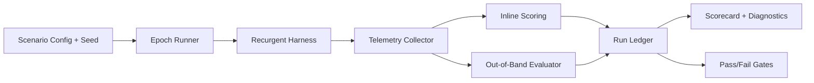

# Recursim Product Specification

## Document Status

- Name: Recursim
- Type: Product Specification
- Status: Draft v1
- Scope: Recurgent simulator for self-contained system growth

## 1. Purpose

Recursim exists to provide evidence, not anecdotes, that Recurgent can:

1. Survive real evolutionary pressure without harness breakage.
2. Produce reliable emergence where local generation is stochastic but global outcomes are predictable.

Recursim is the controlled laboratory where Tool Builders, Tools, and Workers can evolve under repeatable conditions with measurable outcomes.

## 2. Problem Statement

Recurgent currently demonstrates promising behavior in live examples, but example-driven confidence is insufficient.

Missing today:

1. A deterministic simulation harness that repeatedly exercises full lifecycle behavior.
2. A formal definition of "reliable emergent" behavior and how to measure it.
3. A progression model from simple closed domains to open and networked systems.

Without Recursim, regressions hide in ad hoc runs, and evolution claims are not falsifiable.

## 3. Product Goals

### 3.1 Primary Goals

1. Validate harness robustness under long-running, adversarial, and edge-case evolutionary loops.
2. Validate reliable emergence for self-contained systems as the first milestone.
3. Produce reproducible simulation traces and scorecards that can be compared across commits.

### 3.2 Secondary Goals

1. Accelerate discovery of architecture faults before they appear in interactive demos.
2. Provide a canonical benchmark suite for Recurgent evolution quality.
3. Create reusable scenario infrastructure for future simulation classes.

## 4. Non-Goals (V1)

1. Replacing runtime integration tests.
2. Proving performance for distributed/networked Recurgent systems.
3. Implementing autonomous internet-scale multi-agent networking.
4. Hardcoding domain tools in runtime internals.

## 5. Simulation Taxonomy

Recursim supports four system classes over time.

1. Self-contained systems.
Examples: calculator, debate panel.
2. Inter-connected systems.
Examples: daily news purveyor integrating multiple sources.
3. Interactive systems.
Examples: personal assistant with human-in-the-loop corrections.
4. Networked Recurgents.
Examples: federated Recurgents exchanging reusable tools.

V1 targets class 1 only.

## 6. V1 Scope: Self-Contained Growth

### 6.1 V1 Target Domain

Calculator growth curriculum.

1. Core arithmetic: add, subtract, multiply, divide.
2. Input handling: integers, floats, negative values, whitespace tolerance.
3. Error discipline: typed failures (for example divide by zero, invalid expression).
4. Composition: expression evaluation with precedence and parentheses.

### 6.2 Why Calculator First

1. Closed-world correctness oracle is simple and objective.
2. High signal-to-noise ratio for harness defects.
3. Enables many edge cases without external dependencies.
4. Fast simulation cycles enable broad seed sweeps.

## 7. Design Principles

Recursim adheres to Recurgent tenets.

1. Agent-first mental model.
All simulator entities are modeled in Tool Builder/Tool/Worker language.
2. Tolerant interfaces by default.
Scoring and validation use tolerant boundary checks before terminal classification.
3. Runtime ergonomics and clarity before constraints.
Recursim observes and pressures behavior; it does not hardcode domain logic.
4. Ubiquitous language aligned to Agent cognition.
Reports and telemetry use the same vocabulary as runtime prompts and ADRs.

## 8. Reliable Emergence Definition

Reliable emergence means:

1. Local behavior can vary by seed.
2. Global outcomes converge within pre-defined tolerance bands.

### 8.1 Convergence Bands (V1)

Across seed sweep N:

1. Correctness score median >= 95% by epoch threshold E.
2. 90th percentile repair depth <= configured max.
3. Contract violation rate trends downward over epochs.
4. Tool reuse ratio trends upward over epochs.
5. Architecture integrity violations remain zero (or bounded to transient, auto-recovered events).

## 9. Product Requirements

### 9.1 Scenario Definition

Recursim must support scenario packs with:

1. System class.
2. Curriculum stages.
3. Golden input/output cases.
4. Adversarial cases.
5. Evolution pressure profile.
6. Termination criteria.

### 9.2 Epoch Runner

Recursim must execute simulations as epochs.

Each epoch includes:

1. Invocation generation.
2. Tool selection/generation path.
3. Validation-first pre-execution checks.
4. Execution and delegated contract validation.
5. Inline repair lane.
6. Metrics capture.
7. Artifact persistence and selection updates.
8. Out-of-band maintenance lane trigger (when configured).

### 9.3 Failure Injection

Recursim must support deterministic fault injection classes:

1. Provider response defects.
2. Guardrail policy violations.
3. Contract drift/mismatch.
4. Method/interface drift.
5. Runtime execution exceptions.

### 9.4 Measurement and Scoring

Recursim must compute and persist:

1. Correctness score.
2. Utility score.
3. Contract adherence score.
4. Reuse score.
5. Repair efficiency score.
6. Robustness score.
7. Reliable emergence convergence score.

### 9.5 Replay and Diffability

Recursim must provide:

1. Seeded deterministic replay.
2. Baseline comparison across commits.
3. Machine-readable run summaries.
4. Human-readable run narratives for diagnosis.

## 10. Architecture (Recursim Layer)

## 11. Data Model

### 11.1 Simulation Run Metadata

1. `sim_id`
2. `scenario_id`
3. `class`
4. `seed`
5. `epoch_count`
6. `runtime_version`
7. `prompt_version`
8. `started_at`
9. `ended_at`
10. `status`

### 11.2 Epoch Record

1. `epoch_index`
2. `stage`
3. `calls_total`
4. `tool_creations`
5. `tool_reuses`
6. `contract_violations`
7. `guardrail_recoveries`
8. `repair_attempts`
9. `user_correction_signals`
10. `scores`

### 11.3 Aggregate Scorecard

1. `correctness`
2. `robustness`
3. `reuse`
4. `repair_efficiency`
5. `emergence_reliability`
6. `regressions`
7. `recommendations`

## 12. Execution Modes

1. Deterministic mode.
Fixed seeds, no non-deterministic perturbations outside configured injection.
2. Variance mode.
Seed sweep to evaluate convergence spread.
3. Stress mode.
Higher fault rates and adversarial curriculum cases.
4. Soak mode.
Long epoch runs for stability and memory/toolstore behavior.

## 13. Acceptance Criteria (V1)

Recursim V1 is complete when:

1. Self-contained calculator scenario pack is executable end-to-end.
2. Deterministic replay reproduces equivalent scorecard for same commit+seed.
3. Seed sweep report shows convergence metrics and variance bounds.
4. At least one intentional harness regression is detected by Recursim gate.
5. Artifacts and reports are stored in a stable, documented location.

## 14. Operational Outputs

Recursim must emit:

1. `run_manifest.json`
2. `epoch_ledger.jsonl`
3. `scorecard.json`
4. `diagnostic_summary.md`
5. Optional trace pointers into runtime observability logs.

## 15. Rollout Plan

### Phase 1: Simulator Foundation

1. Scenario schema.
2. Epoch runner.
3. Deterministic replay support.
4. Basic scorecard.

### Phase 2: Calculator Curriculum

1. Stage definitions.
2. Golden/adversarial test corpus.
3. Scoring thresholds.
4. Baseline fixture generation.

### Phase 3: Reliability Analytics

1. Seed sweep automation.
2. Convergence and variance reports.
3. Regression gates for CI.

### Phase 4: Evolution Pressure Expansion

1. Fault injection packs.
2. Soak mode.
3. Out-of-band evolution hooks.

## 16. Risks and Mitigations

1. Risk: Overfitting simulator to calculator.
Mitigation: Keep scenario API class-agnostic and add second class after V1 stabilization.
2. Risk: False confidence from narrow metrics.
Mitigation: Include both correctness and architecture-health metrics.
3. Risk: Excessive complexity in v1 simulator core.
Mitigation: Start deterministic and minimal, add lanes incrementally.
4. Risk: Runtime and simulator vocabulary divergence.
Mitigation: Enforce UL glossary and shared naming in reports.

## 17. Open Questions

1. Should Recursim run as a runtime subcommand, standalone script, or both?
2. What are default seed sweep sizes for local vs CI execution?
3. Which scores are hard fail gates vs soft warnings in CI?
4. How should out-of-band evolution actions be applied in deterministic replay mode?

## 18. Appendix: Initial Calculator Curriculum Matrix

| Stage | Capability | Example Inputs | Expected Class |
| --- | --- | --- | --- |
| A1 | add/subtract | `2+2`, `9-12` | correct numeric result |
| A2 | multiply/divide | `7*8`, `10/2` | correct numeric result |
| A3 | error handling | `10/0`, `abc+1` | typed non-retriable errors |
| A4 | expression parsing | `2 + 3 * 4`, `(2+3)*4` | precedence-correct evaluation |
| A5 | tolerance | whitespace, negatives, floats | correct result + stable contracts |

