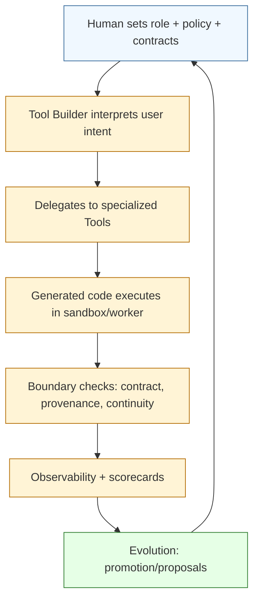

# Tutorial: Personal Assistant (Progressive)

Audience: software engineers who want a practical, stepwise path from first call to governed, observable, profile-aware agent behavior.

This tutorial uses one evolving artifact: [`runtimes/ruby/examples/assistant.rb`](../../runtimes/ruby/examples/assistant.rb).

## What You Are Building

By the end, you should be able to explain and verify:

1. how dynamic dispatch turns one role prompt into many emergent methods,
2. how delegation creates reusable tools with explicit contracts,
3. how provenance, continuity, and authority boundaries prevent "looks fine" failures,
4. how to read traces and propose high-quality runtime changes.

## Chapter Ladder (Why Each Step Exists)

```mermaid
flowchart LR
  C0[0 Dynamic Dispatch] --> C1[1 Runtime Config]
  C1 --> C2[2 Delegation Contracts]
  C2 --> C3[3 Provenance Invariant]
  C3 --> C4[4 Role Continuity]
  C4 --> C5[5 Observability]
  C5 --> C6[6 Awareness vs Authority]
  C6 --> C7[7 Production Readiness]

  classDef foundation fill:#d9f2ff,stroke:#1b6ca8,stroke-width:1px;
  classDef reliability fill:#ffe8cc,stroke:#b35c00,stroke-width:1px;
  classDef governance fill:#e6ffe6,stroke:#2d7a2d,stroke-width:1px;

  class C0,C1 foundation;
  class C2,C3,C4,C5 reliability;
  class C6,C7 governance;
```



## Reading Modes

- Quick Path (15-25 min): run checkpoints only, inspect logs.
- Deep Path (60-120 min): apply each chapter and compare traces phase by phase.

## Prerequisites

1. Follow setup in [`docs/onboarding.md`](../onboarding.md).
2. Work from [`runtimes/ruby`](../../runtimes/ruby).
3. Use isolated state roots to keep traces reproducible.

```bash
cd runtimes/ruby
XDG_STATE_HOME=$PWD/../../tmp/tutorial-assistant/phase-0 bundle exec ruby examples/assistant.rb
```

## Who Writes What (Human vs Agent)

This tutorial shows Ruby snippets so you can understand system mechanics. In real usage:

1. You define the top-level role, runtime policy, and constraints.
2. The Agent (Tool Builder) generates and evolves tool code and method behavior.
3. A trainer model inspects outcomes/logs, then tune contracts and policy where needed.
4. Rinse. Repeat. Review.

Think of snippets as a set of domain specific language, control surfaces, and diagnostics. The snippets are not manual implementations of every tool by a human.

## Copy/Paste Quickstart (10-15 min)

Run one complete loop (assistant + traces) before chapter detail.

```bash
cd runtimes/ruby
ROOT="$PWD/../../tmp/tutorial-assistant/quickstart"
mkdir -p "$ROOT"

cat > "$ROOT/assistant_input.txt" <<'EOF2'
What's the top news items in Google News, Yahoo! News, and NY Times
What's are the action adventure movies playing in theaters
What's a good recipe for Jaffna Kool
quit
EOF2

XDG_STATE_HOME="$ROOT" bundle exec ruby examples/assistant.rb < "$ROOT/assistant_input.txt" | tee "$ROOT/assistant.out"
tail -n 8 "$ROOT/recurgent/recurgent.jsonl"
rg '"depth":0' "$ROOT/recurgent/recurgent.jsonl" | rg '"outcome_status":"error"'
```

What to verify:

1. all three prompts return usable responses,
2. top-level failures (if any) are visible in JSONL,
3. delegation/guardrail behavior is visible without code changes.

## Baseline Mental Model

- Top-level role is a Tool Builder (`Agent.for(...)`).
- Calls return `Agent::Outcome` (`ok?`, `error?`, typed error fields).
- Delegation creates/reuses Tools under runtime policy.
- Runtime state + telemetry are first-class (toolstore + JSONL logs).

References:

- [`docs/architecture.md`](../architecture.md)
- [`docs/ubiquitous-language.md`](../ubiquitous-language.md)
- [`docs/delegate-vs-for.md`](../delegate-vs-for.md)

## Recurgent Terms Used Here

- `Tool Builder`: top-level agent that owns user intent and synthesis.
- `Tool`: delegated agent for narrower capability boundaries.
- `Delegate`: one Tool Builder action to materialize/invoke a Tool.
- `Outcome`: normalized envelope (`ok?`, `value`, typed error fields).
- `Role Profile`: explicit role-level continuity contract.
- `State Continuity Guard`: guardrail that enforces role profile constraints.
- `Shadow Mode`: evaluate/log policy outcomes without blocking success.
- `Enforcement Mode`: policy/profile failures can trigger retries or typed errors.
- `Self Model`: runtime awareness snapshot (`awareness_level`, authority, active versions).
- `Authority Boundary`: observe/propose is open; enact is explicitly gated.

Canonical vocabulary reference:

- [`docs/ubiquitous-language.md`](../ubiquitous-language.md)

---

## Chapter 0: Minimal Assistant

### Why this chapter matters

Everything else in Recurgent builds on one idea: unknown methods route through dynamic dispatch and model-guided generation.

### Goal

Run the assistant and understand the raw interaction loop.

### What changes in the system

At this stage, almost no explicit contracts are set. You are seeing the base dynamic behavior.

### Code snippet

```ruby
require_relative "../lib/recurgent"

assistant = Agent.for(
  "personal assistant that remembers conversation history",
  model: Agent::DEFAULT_MODEL
)

loop do
  print "> "
  input = $stdin.gets&.chomp
  break if input.nil? || %w[quit exit].include?(input.downcase)
  next if input.strip.empty?

  puts assistant.ask(input)
end
```

### Run

```bash
cd runtimes/ruby
XDG_STATE_HOME=$PWD/../../tmp/tutorial-assistant/phase-0 ruby examples/assistant.rb
```

### Checkpoint

1. prompt/response loop works,
2. `ask` returns structured outcomes (success or typed failure).

Deep links:

- [`runtimes/ruby/README.md`](../../runtimes/ruby/README.md)
- [`docs/onboarding.md`](../onboarding.md)

---

## Chapter 1: Runtime Configuration

### Why this chapter matters

Without explicit runtime policy, it is hard to reason about whether behavior was enforced vs merely observed.

### Goal

Configure policy intentionally before creating agents.

### What `Agent.configure_runtime(...)` means in this tutorial

The tutorial example uses these keys:

| Key                                | What it controls                                                             | Why you care                             |
| ---------------------------------- | ---------------------------------------------------------------------------- | ---------------------------------------- |
| `role_profile_shadow_mode_enabled` | Evaluates role profile continuity and logs results without blocking          | calibrate continuity policy safely       |
| `role_profile_enforcement_enabled` | Allows role profile continuity violations to trigger recoverable enforcement | prevent silent sibling-method drift      |
| `promotion_shadow_mode_enabled`    | Evaluates lifecycle promotion decisions without changing selection           | tune promotion thresholds with evidence  |
| `promotion_enforcement_enabled`    | Enforces lifecycle selection decisions                                       | activate reliability-gated default reuse |

For full key set (including authority/dependency/toolstore settings), see:

- [`docs/runtime-configuration.md`](../runtime-configuration.md)

### Code snippet

```ruby
Agent.configure_runtime(
  role_profile_shadow_mode_enabled: true,
  role_profile_enforcement_enabled: true,
  promotion_shadow_mode_enabled: true,
  promotion_enforcement_enabled: false
)
```

### Run

```bash
cd runtimes/ruby
XDG_STATE_HOME=$PWD/../../tmp/tutorial-assistant/phase-1 ruby examples/assistant.rb
```

### Checkpoint

1. `recurgent.jsonl` is written under the phase-specific state root,
2. log fields reflect configured toggles.

Deep links:

- [`docs/runtime-configuration.md`](../runtime-configuration.md)
- [`docs/observability.md`](../observability.md)

---

## Chapter 2: Delegation with Explicit Contracts

### Why this chapter matters

Delegation is the mechanism that turns one generalist Tool Builder into a capability graph of specialized Tools. Contracts make that graph stable and testable.

### What "delegated behavior" means

Delegated behavior is work done by a Tool created/invoked by the Tool Builder via `delegate(...)`, instead of the Tool Builder doing everything inline.

### Goal

Make delegation explicit and contract-governed.

### Code snippet (contract surface)

```ruby
news_tool = assistant.delegate(
  "news_aggregator",
  purpose: "fetch top headlines from multiple sources",
  deliverable: { type: "object", required: %w[headlines provenance] },
  acceptance: [{ assert: "headlines contains concrete items" }],
  failure_policy: { on_error: "return_error" }
)

news = news_tool.get_headlines(sources: %w[google yahoo nytimes])
puts news.ok? ? news.value : "#{news.error_type}: #{news.error_message}"
```

Why this snippet is shown: in practice the Tool Builder often authors equivalent delegation contracts itself. You use this form to understand and debug what the Tool Builder is expected to produce.

### Checkpoint

1. delegated calls appear in logs (`depth > 0`),
2. top-level assistant remains concise while child tools execute specific capability work,
3. failure modes are typed at the boundary.

Deep links:

- [`docs/product-specs/delegation-contracts.md`](../product-specs/delegation-contracts.md)
- [`docs/tolerant-delegation-interfaces.md`](../tolerant-delegation-interfaces.md)
- [`docs/delegate-vs-for.md`](../delegate-vs-for.md)

---

## Chapter 3: External Data + Provenance

### Why this chapter matters

External-data success without provenance is not trustworthy success.

### Goal

Enforce source-aware success semantics on external data.

### Expected success shape

```ruby
{
  headlines: [...],
  provenance: {
    sources: [
      {
        uri: "https://news.google.com/rss?hl=en-US&gl=US&ceid=US:en",
        fetched_at: "2026-02-20T03:54:48Z",
        retrieval_tool: "news_aggregator",
        retrieval_mode: "live"
      }
    ]
  }
}
```

### Checkpoint

1. successful external-data outcomes include provenance sources,
2. missing provenance triggers typed failures and/or recoverable retries.

Deep links:

- [`docs/adrs/0021-external-data-provenance-invariant.md`](../adrs/0021-external-data-provenance-invariant.md)
- [`docs/observability.md`](../observability.md)

---

## Chapter 4: Role Profiles and Continuity Contracts

### Why this chapter matters

Reliability alone is not semantic correctness. Two methods can both "work" while disagreeing on shared-state conventions.

### What a continuity contract is

A continuity contract (Role Profile) defines how sibling methods in one role must stay coherent across state usage, signature family, and/or return-shape family.

### Goal

Move from implicit conventions to explicit role continuity constraints.

### Constraint field semantics

| Field                               | Meaning                                             | Common values                                                                           |
| ----------------------------------- | --------------------------------------------------- | --------------------------------------------------------------------------------------- |
| `kind`                              | what coherence dimension to evaluate                | `:shared_state_slot`, `:return_shape_family`, `:signature_family`                       |
| `scope`                             | which methods participate in the constraint         | `:all_methods` (default), `:explicit_methods`                                           |
| `mode`                              | how strict the rule is                              | `:coordination` (agreement, no fixed value), `:prescriptive` (explicit canonical value) |
| `canonical_key` / `canonical_value` | fixed expected value when prescriptive mode is used | e.g. `:conversation_history`                                                            |
| `exclude_methods`                   | optional carve-out list when scope is broad         | e.g. `%w[history]`                                                                      |

### Example profile

```ruby
ASSISTANT_ROLE_PROFILE = {
  role: "personal assistant that remembers conversation history",
  version: 1,
  constraints: {
    conversation_history_slot: {
      kind: :shared_state_slot,
      scope: :all_methods,
      mode: :prescriptive,
      canonical_key: :conversation_history
    }
  }
}.freeze

assistant = Agent.for(
  "personal assistant that remembers conversation history",
  model: Agent::DEFAULT_MODEL,
  role_profile: ASSISTANT_ROLE_PROFILE
)
```

Why this matters for evolution:

1. coordination mode shapes convergence without dictating exact naming,
2. prescriptive mode pins deterministic behavior when required.

### Checkpoint

1. active profile version appears in telemetry,
2. continuity drift becomes visible and repairable,
3. profile-enabled promotion can include profile-compliance evidence.

Deep links:

- [`docs/adrs/0024-contract-first-role-profiles-and-state-continuity-guard.md`](../adrs/0024-contract-first-role-profiles-and-state-continuity-guard.md)
- [`docs/plans/contract-first-role-profiles-state-continuity-implementation-plan.md`](../plans/contract-first-role-profiles-state-continuity-implementation-plan.md)
- [`docs/ubiquitous-language.md`](../ubiquitous-language.md)

---

## Chapter 5: Observability and Diagnosis

### Why this chapter matters

If you cannot explain a run from logs, you cannot safely evolve the runtime.

### Goal

Read traces as an engineering feedback loop, not just output records.

### Exercise prompts

1. "What's the top news items in Google News, Yahoo! News, and NY Times"
2. "What's are the action adventure movies playing in theaters"
3. "What's a good recipe for Jaffna Kool"

### Log schema references

- [`docs/observability.md`](../observability.md) (field catalog and operator queries)
- [`docs/architecture.md`](../architecture.md) (where observability fits in lifecycle)

### Useful commands

```bash
# quick tail
tail -n 8 "$XDG_STATE_HOME/recurgent/recurgent.jsonl"

# top-level failures
rg '"depth":0' "$XDG_STATE_HOME/recurgent/recurgent.jsonl" | rg '"outcome_status":"error"'

# grouped summary by role + status
ruby -rjson -e '
path = ARGV[0]
entries = File.readlines(path, chomp: true).map { |l| JSON.parse(l) }
pp entries.group_by { |e| e["role"] }.transform_values { |xs|
  xs.group_by { |e| e["outcome_status"] }.transform_values(&:count)
}
' "$XDG_STATE_HOME/recurgent/recurgent.jsonl"
```

### Two annotated JSONL examples

Top-level Tool Builder call (`depth: 0`):

```json
{
  "trace_id": "t-123",
  "call_id": "c-1",
  "depth": 0,
  "role": "personal assistant that remembers conversation history",
  "method": "ask",
  "outcome_status": "ok",
  "duration_ms": 1820,
  "solver_shape_stance": "orchestrate",
  "active_role_profile_version": 1
}
```

Delegated Tool call (`depth: 1`):

```json
{
  "trace_id": "t-123",
  "call_id": "c-2",
  "parent_call_id": "c-1",
  "depth": 1,
  "role": "news_aggregator",
  "method": "get_headlines",
  "outcome_status": "error",
  "outcome_error_type": "tool_registry_violation",
  "guardrail_recovery_attempts": 2,
  "latest_failure_stage": "validation"
}
```

What to read from these quickly:

1. same `trace_id` ties both lines to one user request,
2. parent/child relation explains where failure occurred,
3. retries + failure stage tell you whether this was repairable and where it failed,
4. role/profile fields tell you whether continuity policy was active.

### Using Codex/Claude for log forensics

Prompt template 1:

```text
Read this JSONL trace file: <absolute-path>.
1) Produce a table of top-level calls (timestamp, role, method, status, error_type, duration_ms).
2) Explain each error in engineering terms.
3) Propose the smallest code/config/doc change to fix each, with file references.
```

Prompt template 2:

```text
Compare these two trace files: <baseline-path> and <current-path>.
Show what improved, regressed, and stayed the same.
Then propose one targeted experiment to validate each suspected cause.
```

### Checkpoint

1. you can explain exactly why each request succeeded/failed,
2. you can separate capability gaps from continuity/guardrail/policy issues.

Deep links:

- [`docs/observability.md`](../observability.md)
- [`docs/reports/adr-0024-scope-hardcut-validation-report.md`](../reports/adr-0024-scope-hardcut-validation-report.md)

---

## Chapter 6: Awareness vs Authority

### Why this chapter matters

Reflective systems need explicit governance boundaries: observe/propose should be open; enact should be gated.

### Goal

Allow proposal generation without uncontrolled runtime mutation.

### Code snippet

```ruby
Agent.configure_runtime(
  authority_enforcement_enabled: true,
  authority_maintainers: %w[kulesh]
)

planner = Agent.for("planner")
proposal = planner.propose(
  proposal_type: "role_profile_update",
  target: { role: "personal assistant that remembers conversation history", version: 2 },
  proposed_diff_summary: "tighten conversation history continuity checks"
)
# apply_proposal(...) requires maintainer-authorized actor under enforcement
```

### Checkpoint

1. observe/propose remains available,
2. enact is gated by explicit authority settings and actor identity,
3. unauthorized apply attempts emit typed `authority_denied`.

Deep links:

- [`docs/adrs/0025-awareness-substrate-and-authority-boundary.md`](../adrs/0025-awareness-substrate-and-authority-boundary.md)
- [`docs/plans/awareness-substrate-authority-boundary-implementation-plan.md`](../plans/awareness-substrate-authority-boundary-implementation-plan.md)
- [`docs/runtime-configuration.md`](../runtime-configuration.md)

---

## Chapter 7: Production Readiness Pass

### Why this chapter matters

A good demo is not a release. You need repeatable validation with trace evidence.

### Goal

Convert example behavior into repeatable delivery quality.

### Checklist

1. local gates: `bundle exec rubocop`, `bundle exec rspec`,
2. deterministic validation script for canonical prompts,
3. trace review + issue capture for regressions,
4. PR with linked issue and verification evidence.

### Minimal validation harness

```bash
#!/usr/bin/env bash
set -euo pipefail

cd runtimes/ruby
ROOT="$PWD/../../tmp/tutorial-assistant/prod-check"
mkdir -p "$ROOT"

mise exec -- env XDG_STATE_HOME="$ROOT" bundle exec rubocop
mise exec -- env XDG_STATE_HOME="$ROOT" bundle exec rspec
mise exec -- env XDG_STATE_HOME="$ROOT" ruby examples/assistant.rb < "$ROOT/assistant_input.txt"
```

Deep links:

- [`docs/open-source-release-checklist.md`](../open-source-release-checklist.md)
- [`docs/maintenance.md`](../maintenance.md)
- [`docs/governance.md`](../governance.md)

---

## How Chapters Fit Together



Interpretation:

1. Human sets boundaries and governance.
2. Runtime explores capability space within those boundaries.
3. Evidence feeds controlled evolution; governance decides enactment.

---

## Suggested Exercise Loop per Chapter

1. Run baseline chapter command.
2. Apply chapter change/configuration.
3. Re-run with a fresh `XDG_STATE_HOME`.
4. Capture:
   - command output,
   - JSONL trace summary,
   - one-paragraph diagnosis (`what improved`, `what regressed`, `why`).

## Common Pitfalls

1. Mixing state roots while comparing results.
2. Enabling strict enforcement before enough shadow observations.
3. Treating reliability metrics as semantic correctness guarantees.
4. Over-prescribing role constraints before coordination evidence exists.

## Next Tutorial Candidates

1. Debate moderator (multi-role coordination and structured outcomes).
2. Tool promotion lifecycle (`candidate -> probation -> durable -> degraded`).
3. Proposal-driven role-profile evolution with maintainer approval.
